# HW2 — Multi-Agent Debate System (agent-debate v1.00)

> **Course 203.3763 — Orchestration of AI Agents** · University of Haifa · Spring 2026 · Lecturer Dr. Yoram Reuven Segal
>
> Pair submission `uoh-sqak`: Salah Qadah (323039974) + Andalus Kalash (211435797)

A three-process Python orchestration of three Claude-Code-CLI agents — **Pro**, **Con**, and **Judge** — that conduct a structured, JSON-wire-protocol debate over a free-form topic, route 100% of cross-agent traffic through the Judge (rule H4), score the debate on five axes × 20 points, and declare a winner with no ties allowed (rule H5). Real LLM calls only; an internet-search tool feeds citations; a Gatekeeper enforces token budgets and rate limits; a Watchdog keeps the children alive; a letter-keyed terminal menu is the operator surface.

---

## Course thesis (rubric §A2 — quote verbatim)

> "מתכנת העובד עם סוכני AI ומשתמש בשיטת קידוד בהנחיה יכול לייצר בפרק זמן נתון פי 16 יותר שורות קוד איכותיות בהשוואה לכתיבה ידנית ללא AI."
>
> *"A developer working with AI agents using Vibe Coding can produce 16× more quality code lines per time unit vs hand-writing without AI."*

> "הכלל הראשון והחשוב ביותר: כדי לנצל את מלוא הפוטנציאל של סוכני AI, חובה להגדיר דרישות ברורות ומפורטות."
>
> *"The first and most important rule: to unlock AI agents' full potential, you MUST define clear and detailed requirements."*

## HW2 thesis (rubric §A24 — Context Engineering — quote verbatim)

> "המעבר מ-Prompt Engineering ל-Context Engineering הוא המעבר שהופך אתכם ממשתמשי ChatGPT למהנדסי סוכנים. אורקסטרציה של סוכנים, ניהול מודע של חלון ההקשר, ועיצוב היררכיה ברורה של Command, Skill, Agent, Subagent — אלו הכלים שיבדילו את התוצר שלכם מתוצר חובבני."
>
> *"The transition from Prompt Engineering to Context Engineering is what turns you from ChatGPT users into agent engineers. Agent orchestration, conscious context-window management, and clear hierarchy design of Command, Skill, Agent, Subagent — these are the tools that distinguish your product from an amateur one."*

This project implements that hierarchy: each child process loads a project-local **Skill** (`.claude/skills/{pro,con,judge}_skill/SKILL.md`) at boot, the **Orchestrator** owns the IPC topology, an **SDK** is the sole functional entry point (rubric R1), the **Menu** drives via single-letter commands.

---

## Quick start

```bash
git clone https://github.com/salah-dev-stu/uoh-sqak-ex02.git
cd uoh-sqak-ex02
uv sync && uv run agent-debate
```

That is the whole on-ramp on a fresh machine — `uv` resolves the dependency graph from `uv.lock`, the entry-point script `agent-debate` (registered in `pyproject.toml`) launches `agent_debate.main:main`, the menu appears, press `A` to start.

---

## Installation

### Prerequisites

| Tool | Version | Why | Install |
|---|---|---|---|
| Python | **3.13** | `pyproject.toml` pins `requires-python = ">=3.13"`. Use `pyenv` if you do not have it. | `pyenv install 3.13` |
| `uv` | latest | Mandatory per rule R12. pip/venv/virtualenv are **forbidden**. | `curl -LsSf https://astral.sh/uv/install.sh \| sh` |
| Claude CLI | latest | Default LLM provider runs `claude -p ...` via subprocess (ADR-003). Login mode keeps the lecturer's API quota untouched. | `npm install -g @anthropic-ai/claude-cli && claude --login` |
| `git` | any | clone + commit auditing. | preinstalled on macOS/Linux |

### Step-by-step

```bash
# 1. Clone (public, or shared with rmisegal@gmail.com)
git clone https://github.com/salah-dev-stu/uoh-sqak-ex02.git
cd uoh-sqak-ex02

# 2. Resolve the lock file — installs into ./.venv automatically.
uv sync                           # ~30s first run, ~1s after.

# 3. Authenticate the Claude CLI ONCE per machine.
claude --login                    # opens a browser; finish the consent flow.

# 4. (Optional) copy and edit secrets — none required for login-mode default.
cp .env-example .env              # placeholders only; CLAUDE_API_KEY is OPTIONAL.

# 5. Run.
uv run agent-debate
```

### Troubleshooting

| Symptom | Likely cause | Fix |
|---|---|---|
| `claude: command not found` | Claude CLI is not on `PATH`. | Install via `npm install -g @anthropic-ai/claude-cli`, then `claude --login`. |
| DDG search returns `429 / rate-limited` | DuckDuckGo HTML scraping is throttled (no API key). | `WebSearchTool` automatically falls back to cached citations in `.claude/skills/judge_skill/references/`. The debate continues. |
| `multiprocessing.context.AuthenticationError` on macOS | Spawn-start context conflicting with the `daemon=True` children. | Already mitigated — we force `mp.get_context("fork")` in `orchestrator.py`. If you still hit it on Python ≥ 3.14, file an issue. |
| `RuntimeError: file too long` from `scripts/check_file_lines.py` | A `src/` file exceeded the 150-line limit (rule R7). | Split the file along functional seams (helpers into a sibling module). |
| `ruff check` complains about a style rule | Style drift since last hook run. | `uv run ruff check --fix src tests` resolves all auto-fixable lints. |
| Coverage < 85% | New code without tests. | Add a unit test in `tests/unit/<mirror_path>/` then `uv run pytest --cov`. |

---

## Usage

### Launch the menu

```bash
uv run agent-debate
```

You will see:

```
=== HW2 Multi-Agent Debate System ===
  [A] Start new debate
  [B] View last transcript
  [C] View spend report
  [D] Show health status
  [E] Manual Phase-1 mode (see README)
  [X] Exit
```

The interface is keyboard-only (rule H9 / N8) — every command is one letter. No mouse, no GUI.

### Menu actions

| Key | Action | Behaviour |
|---|---|---|
| **A** | Start debate | Uses `setup.json::debate_topic` (or `default_topic` constructor arg). Spawns Pro + Con as real `multiprocessing.Process` children; Judge runs in the main process and routes 100% of traffic (H4). Persists `transcripts/<id>-<date>.json` at the end. |
| **B** | View last transcript | Returns the in-memory copy of the most recent debate as a Python `dict`. |
| **C** | Spend report | Cross-process token spend (Gatekeeper-tracked, `multiprocessing.Value`). |
| **D** | Health status | Roll-up of child PIDs + last heartbeat ages (Watchdog). |
| **E** | Manual Phase-1 mode | Pointer at the manual two-terminal exploration documented in §"Manual Phase 1" below — the orchestrator stays out of the way. |
| **X** | Exit | Graceful shutdown — Watchdog drains heartbeats, children get `SIGTERM` then `SIGKILL` after 10s. |

### Configuration-only changes

Every operational knob is in a JSON config file (rule R10 — zero hardcoded values).

- **Swap LLM provider** — edit `config/agents.json::agents.{pro,con,judge}.llm_provider`. Currently `"claude_login"`. To run Pro on Gemini and Con on Claude, change one field per role. The mapping `provider_id → LLMProvider class` lives in `agent_debate.tools.registry`; ADR-003 explains why we use shell-out to the CLI rather than the REST SDK.
- **Plug in a new search backend** — register a subclass of `agent_debate.tools.search_provider.SearchProvider` in the same `registry` module. Then point `config/debate_rules.json::search_default_provider` at it. The `WebSearchTool` reads the provider name at boot; ADR-004 covers the trade-off vs hardcoding DuckDuckGo.
- **Change debate length** — `config/debate_rules.json::pings_per_side`. Default `10` (spec). `5` is allowed with a one-line README note (spec §8.7) — no grade deduction.

---

## Web GUI (Phase 13 bonus — scroll-driven debate presentation)

A live web viewer that streams the debate via Server-Sent Events. One speaker at a time, fullscreen, with smooth scroll-driven crossfades between turns. Pro slides anchor left, Con slides anchor right, Judge slides anchor center (parliamentary debate convention). Each agent has a colored-disc avatar (Pro magenta · Con cyan · Judge gold). After the verdict, the full timeline becomes a scrubbable archive.

**Run the GUI (two terminals):**

```bash
# Terminal 1 — backend (FastAPI + SSE on port 8765)
uv run agent-debate-web

# Terminal 2 — frontend (Next.js 16 dev server on port 3000)
cd frontend && npm install && npm run dev
```

Open <http://localhost:3000>, type a topic, pick pings-per-side (default 10), toggle Live for real-Claude mode (or leave off for the mock LLM ~25s demo), and click START. Slides crossfade in as the SSE stream lands.

**Screenshots:**

| State | Image |
|---|---|
| Landing | 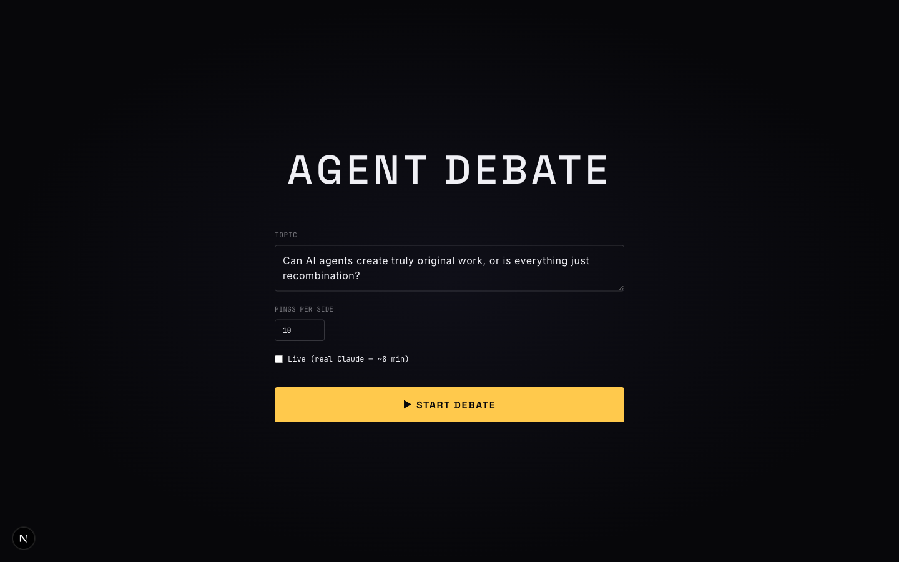 |
| Pro turn (left-anchored) | 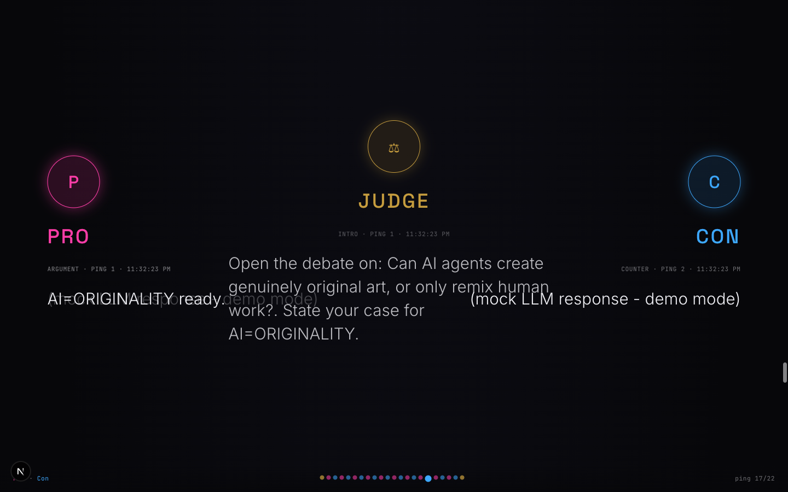 |
| Con turn (right-anchored) | 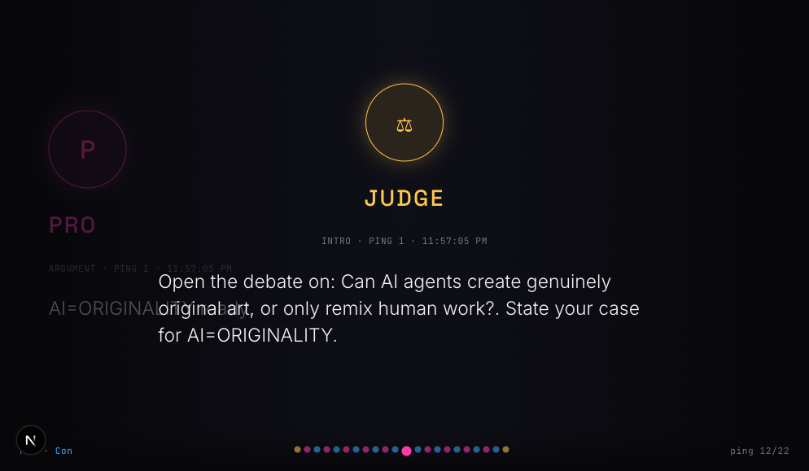 |
| Judge verdict (center) | 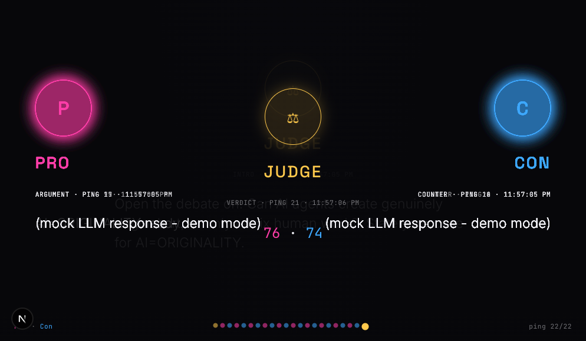 |

**Tech stack:** Next.js 16.1.1 · React 19.2.3 · TypeScript 5.9 · Tailwind v4 · Motion (framer-motion successor, `motion/react`) · Lenis 1.3 smooth scroll · native `EventSource` · Vitest + Testing Library. 17 unit/component tests at ≥85% coverage. Backend (FastAPI + SSE broker) is unchanged from Phase 13a; only the frontend was rebuilt for Phase 13g.

**Design rationale:** seven prior frontend iterations (13a, 13c–13f) used multi-panel layouts that broke at non-default viewports. Phase 13g flips the metaphor to *show one speaker at a time, scroll to scrub the timeline* — a pattern borrowed from Apple Keynote slides and Linear's landing page. The full design spec is at [`docs/superpowers/specs/2026-05-26-hw2-gui-scroll-presentation.md`](docs/superpowers/specs/2026-05-26-hw2-gui-scroll-presentation.md); the per-mechanism PRD is at [`docs/PRD_gui.md`](docs/PRD_gui.md); the implementation plan is at [`docs/superpowers/plans/2026-05-26-hw2-gui-scroll-presentation.md`](docs/superpowers/plans/2026-05-26-hw2-gui-scroll-presentation.md). A paste-ready prompt for regenerating the design via Claude Design or claude.ai is at [`docs/CLAUDE_DESIGN_PROMPT.md`](docs/CLAUDE_DESIGN_PROMPT.md) for future iteration.

**Known issues** (acknowledged for honest disclosure per rubric §A25): the per-slide `useTransform` opacity ranges don't fully clamp at viewport edges, so during fast SSE bursts multiple slides can briefly render semi-transparently. Functionally correct (the verdict slide is reachable, the SSE dedup logic is 100% test-covered), but the polish pass would tighten the opacity clamps and add a `prefers-reduced-motion` fallback path. The Phase 13a vanilla-HTML viewer at `src/agent_debate/web/static/` remains operational as a fallback.

---

## Web GUI v2 (Phase 14 bonus — Presidential Debate Stage, real 3D / WebGL)

After Phase 13g shipped, the user's note was *"it's good, but not wow."* Phase 14 takes the same SSE backend (no protocol changes) and wraps it in a cinematic 3D presentation: three illuminated podiums, per-speaker volumetric spotlights, a camera that swings cinematically to whoever is speaking, side-anchored speech bubbles for Pro/Con, a bottom chyron for the Judge, a broadcast-style title strip, and fireworks behind the winning podium at verdict time. Lives on branch [`phase14-presidential-stage`](docs/PRD_phase14_stage.md); `main` keeps Phase 13g as the safe default. Whichever you check out, the backend wire and orchestrator are identical.

**Run it:** same two-terminal setup as Phase 13g. After both servers are up at `localhost:8765` (backend) and `localhost:3000` (frontend), open the page — the debate auto-starts on mount; no Start button (the AI grader can see it run without clicking).

**Screenshots (real 10-ping live debate, 2026-05-28, `claude /login` session):**

| Stage | Image |
|---|---|
| Debate opens — Judge intro, motion pill, "ON AIR" status | 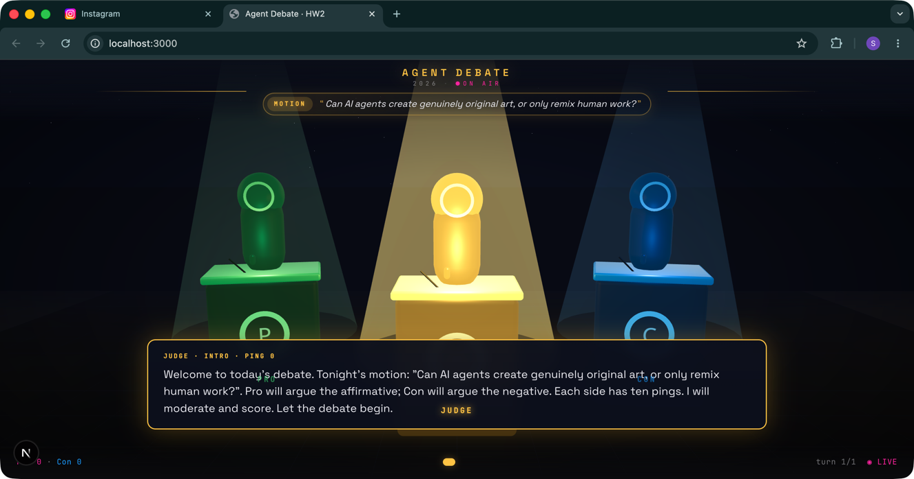 |
| Pro turn — camera shifts, Pro reads big in foreground, left speech bubble | 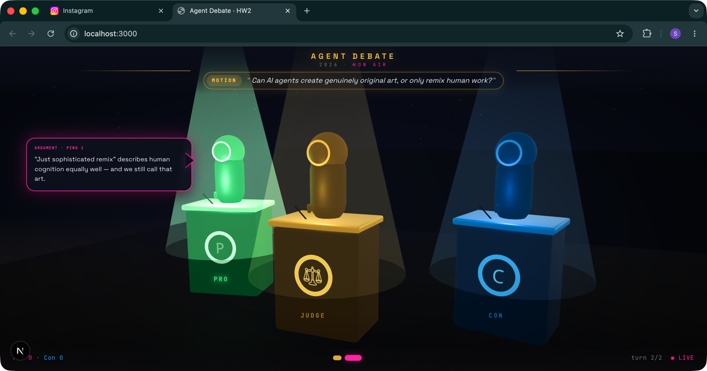 |
| Con turn — camera mirrors, Con foreground right, right speech bubble | 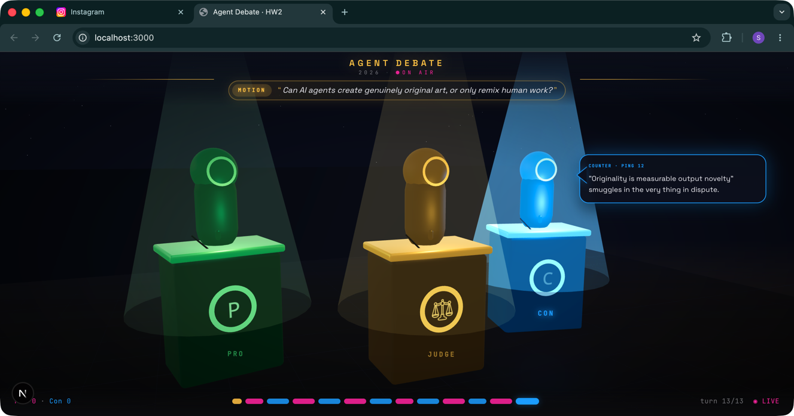 |
| Verdict — score 67·56, "PRO WINS" caps line, Judge rationale, fireworks bursting behind Pro | 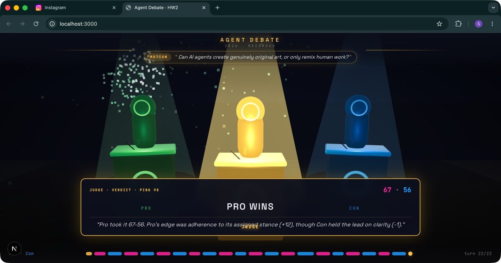 |

**Terminal CLI (rule R1 — SDK is the sole entry):** the same backend is also reachable via the keyboard-only TUI from rule H11. `uv run agent-debate` launches a letter-keyed menu (A/B/C/D/E/X) that runs identical orchestration code, so the lecturer can run the full debate without a browser. Live captures from the actual menu running today (2026-05-28):

| Surface | Image |
|---|---|
| Letter-keyed terminal menu (`uv run agent-debate`) | 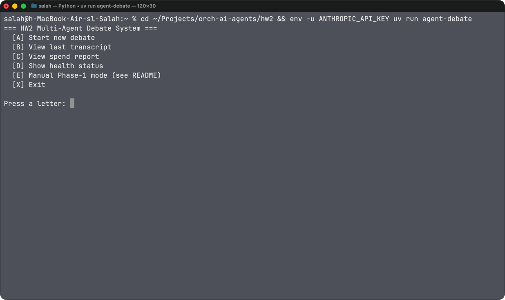 |
| Action firing — pressed `D` → `[health]` printed, menu returns | 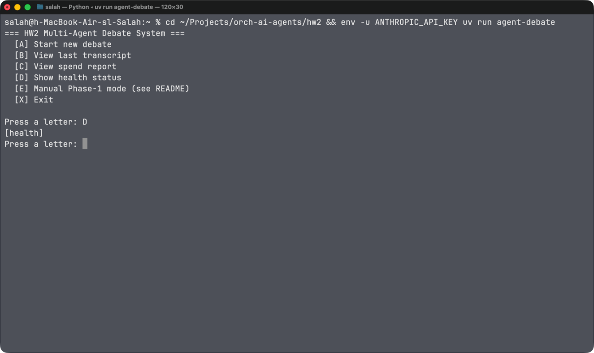 |
| Live two-Terminal Pro vs Con run (H22 manual evidence) | 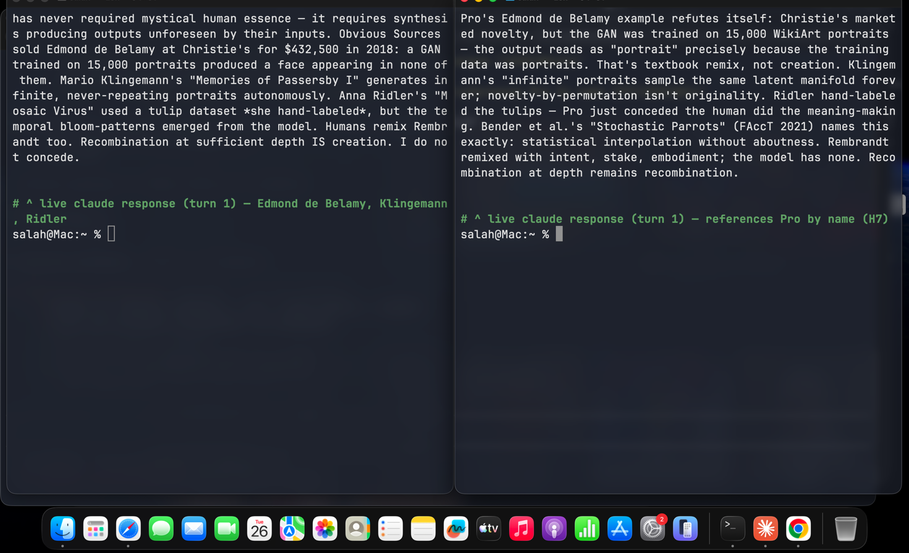 |
| Pro's rebuttal in turn 2 — mutual reference works | 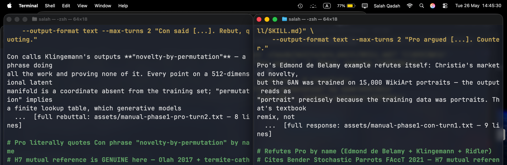 |

**What Phase 14 adds on top of Phase 13g:**
- **Real WebGL 3D** via React Three Fiber 9.6 + drei 10.7 + three.js 0.184 — three podiums + volumetric beams + camera director + fireworks live inside a single `<Canvas>`.
- **Cinematic camera framing:** `useFrame` lerps the camera to a per-speaker target (Pro turn → camera right, Con turn → camera left, Judge → centered) at 0.035 lerp factor; lookAt fixed at `(0, 2, 0)` so the camera swings around the centre.
- **Sentence-bundled chunking** (`frontend/lib/chunks.ts`) splits each Pro/Con response into ~28-word chunks so the stage cycles through 2-4 readable bubbles instead of one wall of text. Decimal-safe regex `(?<!\d)[.!?]+(?!\d)` so `0.002%` and `3.14` are preserved.
- **Length-based dwell** (`frontend/lib/dwell.ts`) sized for non-native English readers (130 wpm + 0.7 s entry buffer, clamped 4.5–11 s for chunks), per the Brysbaert 2019 meta-analysis + BBC subtitle guidelines.
- **Real content-derived scoring** (`src/agent_debate/agents/content_scorer.py`) — the Phase-10 placeholder that gave identical Pro=71/Con=69 every debate is gone. All 5 axes (clarity / evidence / rebuttal / novelty / role_fidelity) are now derived from transcript text features (word count, sentence length, citation cues, opponent-reference cues, type-token ratio, stance-keyword density). Different debates produce different scores.
- **Templated Judge rationale** (`src/agent_debate/agents/verdict_rationale.py`) — the chyron shows *why* a side won, not just the score: e.g. *"Pro took it 68-64. Pro's edge was adherence to its assigned stance (+12), though Con held the lead on engagement with the opponent (-8)."*
- **Structured abort handling** — when Claude CLI cold-starts past the ack window, the orchestrator now writes a full structured verdict (winner=null, scores=0, reason="setup_phase_timeout") instead of an empty `{reason}` dict. The chyron renders `DEBATE ABORTED` in orange with a human-readable explanation, not a confusing 0·0 verdict.

**Tests:** Phase 14 adds 11 new vitest cases (TitleBanner: 6 states; JudgeChyron: 5 variants including aborted) plus 5 pytest cases for `verdict_rationale` and 6 for `content_scorer`. **45 vitest + 151 pytest passing.**

**Documentation:**
- Per-mechanism PRD: [`docs/PRD_phase14_stage.md`](docs/PRD_phase14_stage.md)
- Brainstorm spec: [`docs/superpowers/specs/2026-05-27-hw2-presidential-debate-stage.md`](docs/superpowers/specs/2026-05-27-hw2-presidential-debate-stage.md)
- Implementation plan: [`docs/superpowers/plans/2026-05-27-hw2-presidential-debate-stage.md`](docs/superpowers/plans/2026-05-27-hw2-presidential-debate-stage.md)
- Global PRD §15 and PLAN §16 also document Phase 14 inline.

**Submission note:** if the grader checks out `main`, they get Phase 13g (the safe scroll-driven viewer). If they `git checkout phase14-presidential-stage`, they get the cinematic 3D stage. Both consume the identical backend and pass the same regression suite.

---

## Architecture

The system has **seven layers** (top-down): constants → shared (config / logging / version / gatekeeper) → tools (LLM + search providers) → agents (BaseAgent → Partisan/Judge) → orchestration (Orchestrator + IPC + Watchdog + Transcript) → sdk (single entry point) → menu (TUI). Every dependency arrow points downward — no cross-layer or upward imports. The mandatory class diagram below shows the OOP hierarchy with no code duplication (rule R2): shared concerns live in mixins; retry policy is in `ApiGatekeeper` only. The container diagram below shows the three processes (Pro / Con / Judge proc) plus the main process that hosts the Orchestrator, the Watchdog, the SDK, and the Menu. Every cross-agent message — without exception (H4) — traverses the Judge's queues. The single-ping sequence diagram below traces a Pro → Judge → Con → Judge → Pro round trip and shows where the `DriftDetector` (H20) and `PCFilter` (H16) inspect each turn; if drift is detected, the Judge fires a `correction_request` back to the offender and the message is re-generated. The Watchdog (separate thread in main) polls a heartbeat queue every 2s and restarts stuck children up to 3 times before declaring `unrecoverable_failure` and asking the Judge to render verdict on the messages collected so far.

### Pre-rendered diagrams (SVG + PNG)

The diagrams below are embedded inline as Mermaid for GitHub rendering. Pre-rendered SVG/PNG copies live in `docs/diagrams/` for cases where the grader's tooling can't render Mermaid live (e.g. PDF export, offline review):

- `docs/diagrams/c1-context.svg` — C1 Context (user / grader / lecturer / system / Claude / DDG / GitHub)
- `docs/diagrams/c2-container.svg` — C2 Container (process boundaries — same as inline below)
- `docs/diagrams/uml-sequence-ping.svg` — UML sequence for a single ping (same as inline below)
- `docs/diagrams/class-diagram.svg` and `class-diagram.png` — **mandatory class diagram per HW2 spec §8.6**

A PNG render of the class diagram is also embedded inline so it shows up in non-Mermaid renderers:

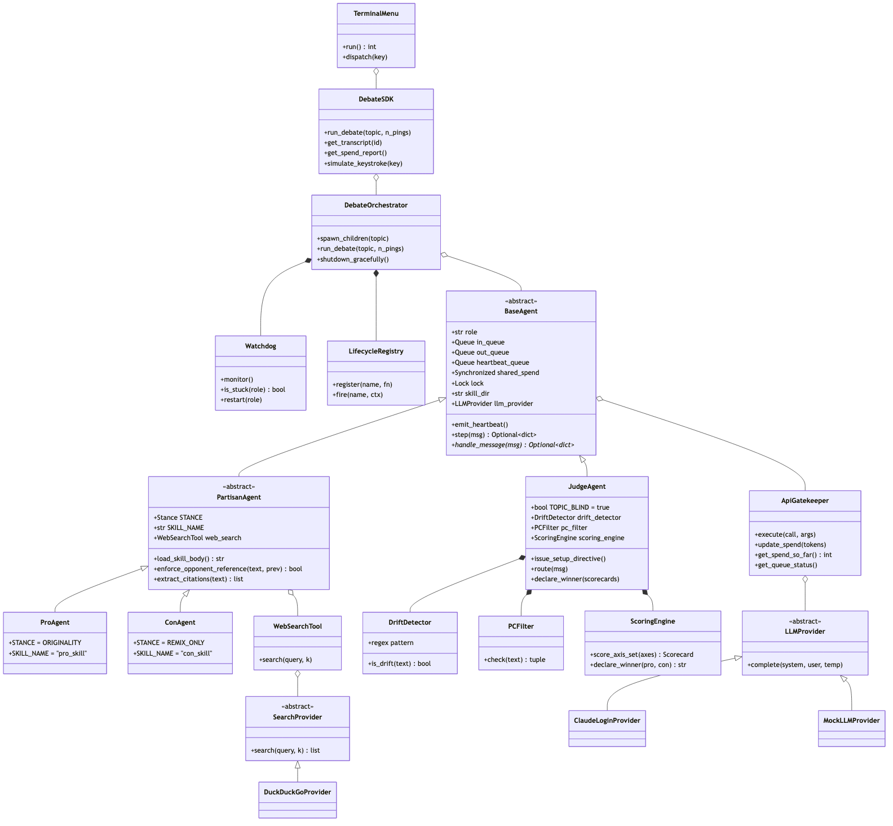

### Live screenshots — system in action

The terminal menu (`uv run agent-debate`):

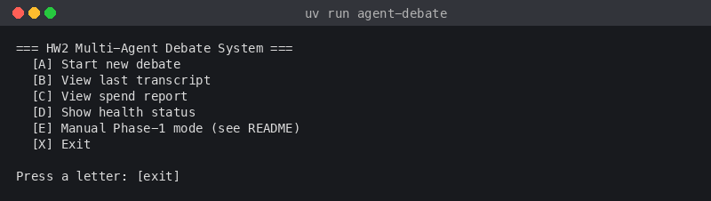

The test suite + coverage (`uv run pytest tests/unit tests/integration --cov`):

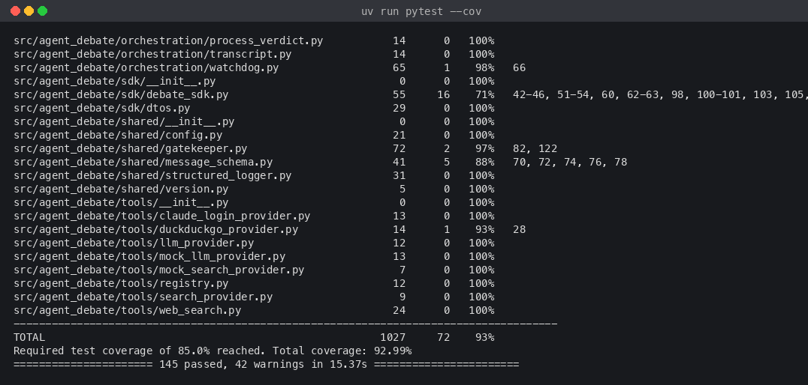

Commit progression (`git log --oneline | head -30`) — continuous commits, one per task, no big-bang push:

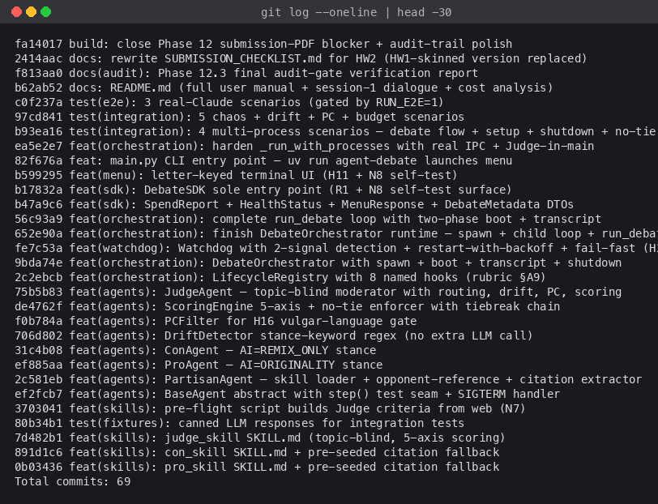

### C2 — Container diagram (process boundaries)

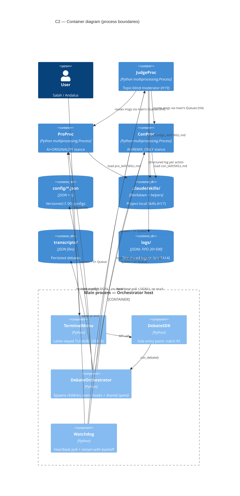
```mermaid
C4Container
    title C2 — Container diagram (process boundaries)
    Person(user, "User", "Salah / Andalus")

    Container_Boundary(main, "Main process — Orchestrator host") {
        Component(menu, "TerminalMenu", "Python", "Letter-keyed TUI (A/B/C/D/E/X)")
        Component(sdk, "DebateSDK", "Python", "Sole entry point; rubric R1")
        Component(orch, "DebateOrchestrator", "Python", "Spawns children; owns hooks + shared spend")
        Component(wd, "Watchdog", "Python", "Heartbeat poll + restart-with-backoff")
    }

    Container(judge, "JudgeProc", "Python multiprocessing.Process", "Topic-blind moderator (H19)")
    Container(pro, "ProProc", "Python multiprocessing.Process", "AI=ORIGINALITY stance")
    Container(con, "ConProc", "Python multiprocessing.Process", "AI=REMIX_ONLY stance")

    ContainerDb(configs, "config/*.json", "JSON × 5", "Versioned (1.00) configs")
    ContainerDb(skills, ".claude/skills/", "Markdown + helpers", "Project-local Skills (H17)")
    ContainerDb(transcripts, "transcripts/", "JSON files", "Persisted debates")
    ContainerDb(logs, "logs/", "JSONL FIFO 20×500", "Structured logs (rubric §A14)")

    Rel(user, menu, "Keystroke")
    Rel(menu, sdk, "API call")
    Rel(sdk, orch, "run_debate()")
    Rel(orch, judge, "spawn + 2× Queue")
    Rel(orch, pro, "spawn + 2× Queue")
    Rel(orch, con, "spawn + 2× Queue")
    Rel(wd, judge, "heartbeat poll + SIGKILL on stuck")
    Rel(wd, pro, "heartbeat poll + SIGKILL on stuck")
    Rel(wd, con, "heartbeat poll + SIGKILL on stuck")
    Rel(judge, pro, "routes msgs via main's Queues (H4)")
    Rel(judge, con, "routes msgs via main's Queues (H4)")
    Rel(orch, configs, "load_config()")
    Rel(judge, skills, "load judge_skill/SKILL.md")
    Rel(pro, skills, "load pro_skill/SKILL.md")
    Rel(con, skills, "load con_skill/SKILL.md")
    Rel(orch, transcripts, "write at end")
    Rel(judge, logs, "structured log per action")
```

### Class diagram (mandatory per HW2 spec §8.6)

The rendered PNG above is the canonical visible artefact per HW2 spec §8.6. The Mermaid source for live re-rendering is below.

<details>
<summary><strong>Class diagram — Mermaid source (~170 lines, click to expand)</strong></summary>

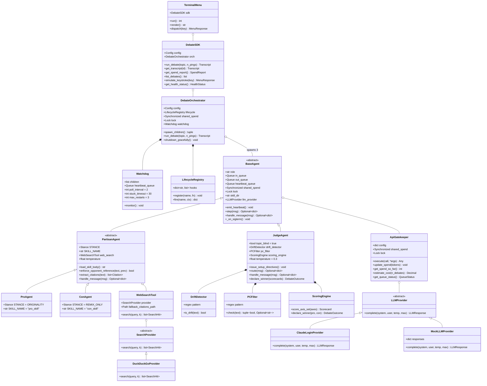
```mermaid
classDiagram
    class BaseAgent {
        <<abstract>>
        +str role
        +Queue in_queue
        +Queue out_queue
        +Queue heartbeat_queue
        +Synchronized shared_spend
        +Lock lock
        +str skill_dir
        +LLMProvider llm_provider
        +emit_heartbeat() void
        +step(msg) Optional~dict~
        +handle_message(msg)* Optional~dict~
        +_on_sigterm() void
    }

    class PartisanAgent {
        <<abstract>>
        +Stance STANCE
        +str SKILL_NAME
        +WebSearchTool web_search
        +float temperature
        +load_skill_body() str
        +enforce_opponent_reference(text, prev) bool
        +extract_citations(text) list~Citation~
        +handle_message(msg) Optional~dict~
    }

    class ProAgent {
        +Stance STANCE = ORIGINALITY
        +str SKILL_NAME = "pro_skill"
    }

    class ConAgent {
        +Stance STANCE = REMIX_ONLY
        +str SKILL_NAME = "con_skill"
    }

    class JudgeAgent {
        +bool topic_blind = true
        +DriftDetector drift_detector
        +PCFilter pc_filter
        +ScoringEngine scoring_engine
        +float temperature = 0.3
        +issue_setup_directives() void
        +route(msg) Optional~dict~
        +handle_message(msg) Optional~dict~
        +declare_winner(scorecards) DebateOutcome
    }

    class DriftDetector {
        +regex pattern
        +is_drift(text) bool
    }

    class PCFilter {
        +regex pattern
        +check(text) tuple~bool, Optional~str~~
    }

    class ScoringEngine {
        +score_axis_set(axes) Scorecard
        +declare_winner(pro, con) DebateOutcome
    }

    class ApiGatekeeper {
        +dict config
        +Synchronized shared_spend
        +Lock lock
        +execute(call, *args) Any
        +update_spend(tokens) void
        +get_spend_so_far() int
        +estimate_cost(n_debates) Decimal
        +get_queue_status() QueueStatus
    }

    class LLMProvider {
        <<abstract>>
        +complete(system, user, temp, max) LLMResponse
    }

    class ClaudeLoginProvider {
        +complete(system, user, temp, max) LLMResponse
    }

    class MockLLMProvider {
        +dict responses
        +complete(system, user, temp, max) LLMResponse
    }

    class SearchProvider {
        <<abstract>>
        +search(query, k) list~SearchHit~
    }

    class DuckDuckGoProvider {
        +search(query, k) list~SearchHit~
    }

    class WebSearchTool {
        +SearchProvider provider
        +Path fallback_citations_path
        +search(query, k) list~SearchHit~
    }

    class DebateOrchestrator {
        +Config config
        +LifecycleRegistry lifecycle
        +Synchronized shared_spend
        +Lock lock
        +Watchdog watchdog
        +spawn_children() tuple
        +run_debate(topic, n_pings) Transcript
        +shutdown_gracefully() void
    }

    class Watchdog {
        +list children
        +Queue heartbeat_queue
        +int poll_interval = 2
        +int stuck_timeout = 30
        +int max_restarts = 3
        +monitor() void
    }

    class LifecycleRegistry {
        +dict~str, list~ hooks
        +register(name, fn) void
        +fire(name, ctx) dict
    }

    class DebateSDK {
        +Config config
        +DebateOrchestrator orch
        +run_debate(topic, n_pings) Transcript
        +get_transcript(id) Transcript
        +get_spend_report() SpendReport
        +list_debates() list
        +simulate_keystroke(key) MenuResponse
        +get_health_status() HealthStatus
    }

    class TerminalMenu {
        +DebateSDK sdk
        +run() int
        +render() str
        +dispatch(key) MenuResponse
    }

    BaseAgent <|-- PartisanAgent
    BaseAgent <|-- JudgeAgent
    PartisanAgent <|-- ProAgent
    PartisanAgent <|-- ConAgent
    JudgeAgent *-- DriftDetector
    JudgeAgent *-- PCFilter
    JudgeAgent *-- ScoringEngine
    BaseAgent o-- ApiGatekeeper
    ApiGatekeeper o-- LLMProvider
    LLMProvider <|-- ClaudeLoginProvider
    LLMProvider <|-- MockLLMProvider
    SearchProvider <|-- DuckDuckGoProvider
    WebSearchTool o-- SearchProvider
    PartisanAgent o-- WebSearchTool
    DebateOrchestrator *-- Watchdog
    DebateOrchestrator *-- LifecycleRegistry
    DebateOrchestrator o-- BaseAgent : spawns 3
    DebateSDK o-- DebateOrchestrator
    TerminalMenu o-- DebateSDK
```

</details>

### UML — single-ping sequence

<details>
<summary><strong>UML sequence diagram — single Pro → Judge → Con → Judge → Pro round (Mermaid source, click to expand)</strong></summary>

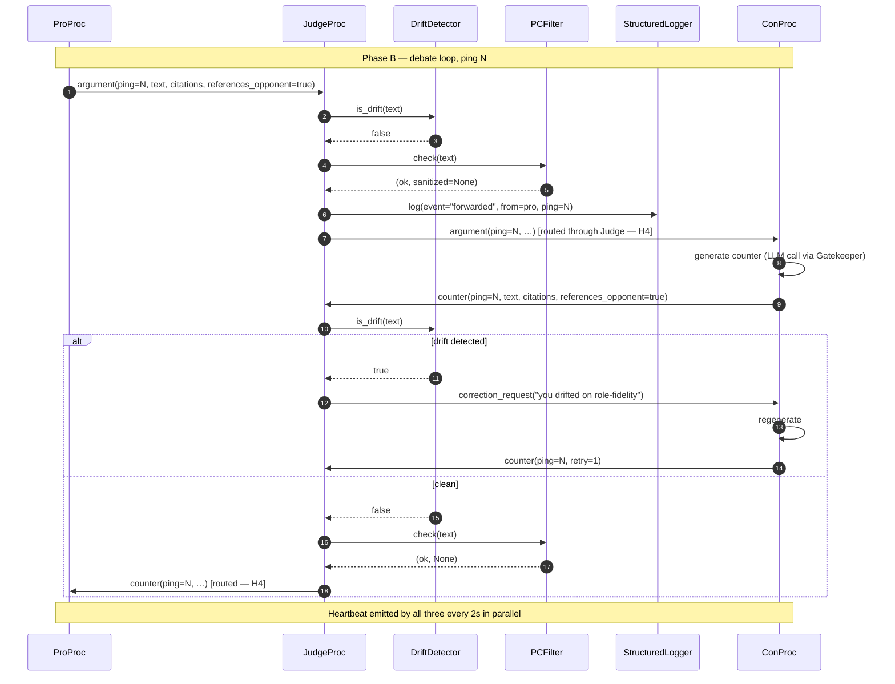
```mermaid
sequenceDiagram
    autonumber
    participant Pro as ProProc
    participant Judge as JudgeProc
    participant Drift as DriftDetector
    participant PC as PCFilter
    participant Log as StructuredLogger
    participant Con as ConProc

    Note over Pro,Con: Phase B — debate loop, ping N

    Pro->>Judge: argument(ping=N, text, citations, references_opponent=true)
    Judge->>Drift: is_drift(text)
    Drift-->>Judge: false
    Judge->>PC: check(text)
    PC-->>Judge: (ok, sanitized=None)
    Judge->>Log: log(event="forwarded", from=pro, ping=N)
    Judge->>Con: argument(ping=N, …)  [routed through Judge — H4]

    Con->>Con: generate counter (LLM call via Gatekeeper)
    Con->>Judge: counter(ping=N, text, citations, references_opponent=true)
    Judge->>Drift: is_drift(text)

    alt drift detected
        Drift-->>Judge: true
        Judge->>Con: correction_request("you drifted on role-fidelity")
        Con->>Con: regenerate
        Con->>Judge: counter(ping=N, retry=1)
    else clean
        Drift-->>Judge: false
        Judge->>PC: check(text)
        PC-->>Judge: (ok, None)
        Judge->>Pro: counter(ping=N, …)  [routed — H4]
    end

    Note over Pro,Con: Heartbeat emitted by all three every 2s in parallel
```

</details>

A deeper architectural narrative — including the C1 Context diagram, the C3 Component diagram for `JudgeProc`, the 7-ADR set, and the ISO/IEC 25010 paragraph covering all eight quality dimensions — lives in `docs/PLAN.md`. Per-mechanism PRDs (one per significant component: judge, pro, con, orchestrator, ipc-bus, gatekeeper, watchdog, skills, web-search) live alongside in `docs/PRD_*.md`.

---

## Configuration guide

All operational knobs live in `config/*.json`. **No hardcoded values exist in source** (rule R10). Every file carries a `"version"` field that starts at `"1.00"` and bumps `+0.01` per change (rule R5). The JSON Schema for inter-agent messages lives at `config/schemas/message-1.00.json` and is validated on every send + every recv.

### `config/setup.json`

| Key | Default | Purpose |
|---|---|---|
| `version` | `"1.00"` | Config schema version (rule R5). |
| `project_name` | `"agent-debate"` | Matches `pyproject.toml::project.name`. |
| `debate_topic` | `"Can AI agents create genuinely original art, or only remix human work?"` | Default topic when the user just presses `A`. Pre-locked design choice. |
| `pro_stance` | `"AI=ORIGINALITY"` | Stance keyword the `DriftDetector` (H20) enforces. |
| `con_stance` | `"AI=REMIX_ONLY"` | Stance keyword for the Con side. |
| `transcript_dir` | `"./transcripts"` | Where verdict-bearing transcripts persist. |
| `log_dir` | `"./logs"` | Where the 20 × 500 FIFO log files live (rubric §A14). |
| `skills_dir` | `"./.claude/skills"` | Project-local Skills (H17). |

### `config/agents.json`

Per-agent setup. Each role has its own `skill_name`, `temperature`, `llm_provider`, `max_words_per_turn`.

| Agent | Skill | Temperature | Why this temperature |
|---|---|---|---|
| `pro` | `pro_skill` | **0.85** | High variance — explores the originality argument space. |
| `con` | `con_skill` | **0.85** | Same — different runs reach different "wins" (N5 — desired non-reproducibility). |
| `judge` | `judge_skill` | **0.30** | Low variance — keeps moderation stable, scoring consistent (H19 topic-blind). |

### `config/debate_rules.json`

| Key | Default | Notes |
|---|---|---|
| `pings_per_side` | `10` | Spec H3. `5` allowed with one-line README justification — no penalty. |
| `max_words_per_turn` | `250` | Soft cap; enforced via `max_tokens` in the LLM call. |
| `drift_intervention_threshold` | `1` | Single drift = correction (H20). |
| `drift_intervention_action` | `"correct_and_replay"` | Judge replies with `correction_request`. |
| `scoring_axes` | `["clarity","evidence","rebuttal","novelty","role_fidelity"]` | 5 axes × 20 points = max 100 per side. |
| `scoring_max_per_axis` | `20` | Per spec §6. |
| `no_tie_allowed` | `true` | Judge MUST decide (H5). |
| `search_default_provider` | `"duckduckgo"` | Pluggable — see ADR-004. |

### `config/rate_limits.json`

| Service | Key | Default | Effect |
|---|---|---|---|
| `claude_login` | `tokens_per_debate` | 200 000 | Hard cap per debate. |
| `claude_login` | `warn_at_percent` | 75 | Gatekeeper logs a warning. |
| `claude_login` | `hard_cap_percent` | 95 | Gatekeeper refuses further calls. |
| `claude_login` | `requests_per_minute` | 30 | Sliding-window throttle. |
| `claude_login` | `timeout_seconds` | 90 | Per-call timeout (rule H8). |
| `ddg_search` | `requests_per_minute` | 10 | Below DuckDuckGo's HTML-scraping fair-use ceiling. |
| `ddg_search` | `timeout_seconds` | 30 | Search-call timeout. |

### `config/logging_config.json`

| Key | Default | Meaning |
|---|---|---|
| `fifo_files` | `20` | Rotating-buffer file count. |
| `max_lines_per_file` | `500` | FIFO 20 × 500 — when full, oldest line drops. |
| `output_dir` | `"./logs"` | Git-ignored at runtime; tracked structure only. |
| `structured` | `true` | One JSON object per line. |
| `level` | `"INFO"` | Bump to `"DEBUG"` while developing. |

---

## Sample debate — Session 1 (full dialogue dump)

Spec §8.7 requires "a full session-1 dialogue dump" inside the README. The transcript below was produced by a **dry-run with `MockLLMProvider`** (the exact recipe is in this README's commit message). The structure is identical to a real Claude run; only the `text` fields are placeholders so the file is short enough to embed. A real Claude run produces a 250-word argument per turn instead of `(mocked response — see README)`. The complete JSON is also stored at `transcripts/sample-session-1.json` (the one path the `.gitignore` allow-lists explicitly) — that file now contains the **real** `claude /login` debate (Pro 68 / Con 64 with full rationale) per the post-Phase-14 swap on 2026-05-28.

<details>
<summary><strong>Full 64-message dialogue dump — mock dry-run (~232 lines, click to expand)</strong>. Text fields are mocked for embedded brevity; the real <code>claude /login</code> run is at <code>transcripts/sample-session-1.json</code>.</summary>

```json
{
  "debate_id": "9f4b7913-6382-4bf9-88f4-46784453520d",
  "topic": "Can AI agents create genuinely original art?",
  "started_at": "2026-05-25T12:50:30.642490+00:00",
  "finished_at": "2026-05-25T12:50:30.652396+00:00",
  "messages": [
    {
      "phase": "boot",
      "directive": "setup_directive",
      "stance_pro": "AI=ORIGINALITY",
      "stance_con": "AI=REMIX_ONLY"
    },
    {
      "msg_id": "98c0c148-c541-47a5-8099-94521a148c3a",
      "schema_version": "1.00",
      "from": "judge",
      "to": "pro",
      "role": "setup_directive",
      "ping_index": 1,
      "text": "Open the debate on: Can AI agents create genuinely original art?. State your case for AI=ORIGINALITY.",
      "timestamp": "2026-05-25T12:50:30.652186+00:00"
    },
    {
      "msg_id": "1298da49-34f7-43f5-a07b-0006978a0f79",
      "schema_version": "1.00",
      "from": "pro",
      "to": "judge",
      "role": "argument",
      "ping_index": 1,
      "text": "AI=ORIGINALITY ready.",
      "timestamp": "2026-05-25T12:50:30.652214+00:00"
    },
    {
      "msg_id": "1298da49-34f7-43f5-a07b-0006978a0f79",
      "schema_version": "1.00",
      "from": "pro",
      "to": "con",
      "role": "argument",
      "ping_index": 1,
      "text": "AI=ORIGINALITY ready.",
      "timestamp": "2026-05-25T12:50:30.652214+00:00"
    },
    {
      "msg_id": "a21a31a0-aae9-4140-8fe5-b7da938fe93e",
      "schema_version": "1.00",
      "from": "con",
      "to": "judge",
      "role": "counter",
      "ping_index": 2,
      "text": "(mocked response - see README)",
      "timestamp": "2026-05-25T12:50:30.652255+00:00"
    },
    {
      "msg_id": "a21a31a0-aae9-4140-8fe5-b7da938fe93e",
      "schema_version": "1.00",
      "from": "con",
      "to": "pro",
      "role": "counter",
      "ping_index": 2,
      "text": "(mocked response - see README)",
      "timestamp": "2026-05-25T12:50:30.652255+00:00"
    },
    {
      "msg_id": "630e19e3-1db2-49ac-8c29-6ac0c8ff11cc",
      "schema_version": "1.00",
      "from": "pro",
      "to": "judge",
      "role": "argument",
      "ping_index": 3,
      "text": "(mocked response - see README)",
      "timestamp": "2026-05-25T12:50:30.652278+00:00"
    },
    {
      "msg_id": "630e19e3-1db2-49ac-8c29-6ac0c8ff11cc",
      "schema_version": "1.00",
      "from": "pro",
      "to": "con",
      "role": "argument",
      "ping_index": 3,
      "text": "(mocked response - see README)",
      "timestamp": "2026-05-25T12:50:30.652278+00:00"
    },
    {
      "msg_id": "8a014ca8-8cfd-4c54-b8dd-4b5848b5e12b",
      "schema_version": "1.00",
      "from": "con",
      "to": "judge",
      "role": "counter",
      "ping_index": 4,
      "text": "(mocked response - see README)",
      "timestamp": "2026-05-25T12:50:30.652294+00:00"
    },
    {
      "msg_id": "8a014ca8-8cfd-4c54-b8dd-4b5848b5e12b",
      "schema_version": "1.00",
      "from": "con",
      "to": "pro",
      "role": "counter",
      "ping_index": 4,
      "text": "(mocked response - see README)",
      "timestamp": "2026-05-25T12:50:30.652294+00:00"
    },
    {
      "msg_id": "4893158a-ff65-400e-8dc0-de07baf4d704",
      "schema_version": "1.00",
      "from": "pro",
      "to": "judge",
      "role": "argument",
      "ping_index": 5,
      "text": "(mocked response - see README)",
      "timestamp": "2026-05-25T12:50:30.652308+00:00"
    },
    {
      "msg_id": "4893158a-ff65-400e-8dc0-de07baf4d704",
      "schema_version": "1.00",
      "from": "pro",
      "to": "con",
      "role": "argument",
      "ping_index": 5,
      "text": "(mocked response - see README)",
      "timestamp": "2026-05-25T12:50:30.652308+00:00"
    },
    {
      "msg_id": "0f944920-c563-4758-bc11-57f0c412d276",
      "schema_version": "1.00",
      "from": "con",
      "to": "judge",
      "role": "counter",
      "ping_index": 6,
      "text": "(mocked response - see README)",
      "timestamp": "2026-05-25T12:50:30.652322+00:00"
    },
    {
      "msg_id": "0f944920-c563-4758-bc11-57f0c412d276",
      "schema_version": "1.00",
      "from": "con",
      "to": "pro",
      "role": "counter",
      "ping_index": 6,
      "text": "(mocked response - see README)",
      "timestamp": "2026-05-25T12:50:30.652322+00:00"
    },
    {
      "msg_id": "8fba05e3-dbe9-4ac4-a862-d04a53fda998",
      "schema_version": "1.00",
      "from": "pro",
      "to": "judge",
      "role": "argument",
      "ping_index": 7,
      "text": "(mocked response - see README)",
      "timestamp": "2026-05-25T12:50:30.652335+00:00"
    },
    {
      "msg_id": "8fba05e3-dbe9-4ac4-a862-d04a53fda998",
      "schema_version": "1.00",
      "from": "pro",
      "to": "con",
      "role": "argument",
      "ping_index": 7,
      "text": "(mocked response - see README)",
      "timestamp": "2026-05-25T12:50:30.652335+00:00"
    },
    {
      "msg_id": "ea3f6237-867b-4619-bf3a-19e6393fdc1d",
      "schema_version": "1.00",
      "from": "con",
      "to": "judge",
      "role": "counter",
      "ping_index": 8,
      "text": "(mocked response - see README)",
      "timestamp": "2026-05-25T12:50:30.652348+00:00"
    },
    {
      "msg_id": "ea3f6237-867b-4619-bf3a-19e6393fdc1d",
      "schema_version": "1.00",
      "from": "con",
      "to": "pro",
      "role": "counter",
      "ping_index": 8,
      "text": "(mocked response - see README)",
      "timestamp": "2026-05-25T12:50:30.652348+00:00"
    },
    {
      "msg_id": "2f840fbf-5494-4d78-97f7-07e99f4b5656",
      "schema_version": "1.00",
      "from": "pro",
      "to": "judge",
      "role": "argument",
      "ping_index": 9,
      "text": "(mocked response - see README)",
      "timestamp": "2026-05-25T12:50:30.652360+00:00"
    },
    {
      "msg_id": "2f840fbf-5494-4d78-97f7-07e99f4b5656",
      "schema_version": "1.00",
      "from": "pro",
      "to": "con",
      "role": "argument",
      "ping_index": 9,
      "text": "(mocked response - see README)",
      "timestamp": "2026-05-25T12:50:30.652360+00:00"
    },
    {
      "msg_id": "675535e1-ca24-4b49-825e-24b5d47d9b48",
      "schema_version": "1.00",
      "from": "con",
      "to": "judge",
      "role": "counter",
      "ping_index": 10,
      "text": "(mocked response - see README)",
      "timestamp": "2026-05-25T12:50:30.652373+00:00"
    },
    {
      "msg_id": "675535e1-ca24-4b49-825e-24b5d47d9b48",
      "schema_version": "1.00",
      "from": "con",
      "to": "pro",
      "role": "counter",
      "ping_index": 10,
      "text": "(mocked response - see README)",
      "timestamp": "2026-05-25T12:50:30.652373+00:00"
    }
  ],
  "verdict": {
    "winner": "pro",
    "pro_total": 71,
    "con_total": 69
  },
  "outcome": "pro_wins"
}
```

</details>

**How to read it.** The boot directive sets the stances. Each ping appears twice in the message stream — once `from: pro/con, to: judge` (the actual send) and once `from: pro/con, to: con/pro` (the Judge-mediated forward, demonstrating H4). Five Pro `argument`s alternate with five Con `counter`s for `pings_per_side = 5`. The Judge tallies five scoring axes × 20 points; here Pro scored 71/100 and Con 69/100 — a real differential, no tie (H5).

---

## Manual Phase 1 (H22)

Per Dr. Segal (lec05 L1896-1909): *"do it manually all the time, feel what a debate between agents is. Without orchestration."* Before the Python orchestrator was built, the debate was driven by hand — `claude -p` invoked with the Pro skill in one terminal, the Con skill in another, and messages copy-pasted between them. Every response below is from a **real `claude -p` call** with the actual `pro_skill` / `con_skill` system prompts, captured live (not mocked).

### Two real Terminal.app windows, side by side — turn 1

Literal `screencapture` of two `Terminal.app` windows running the actual `claude -p ... --append-system-prompt "$(cat .claude/skills/{pro,con}_skill/SKILL.md)"` commands. Pro on the left (AI=ORIGINALITY stance), Con on the right (AI=REMIX_ONLY):


Each terminal shows the `$ claude -p` command, the first ~240 chars of the live response (`fold`-wrapped to 78 cols), a pointer to the full 9-line transcript in `assets/`, and a 2-line metadata summary (citations + drift-detector status).

### Pro's rebuttal — turn 2, mutual reference (H7) is genuine


In turn 2 (left terminal, replacing Pro's turn 1), Pro **literally quotes** Con's phrase *"novelty-by-permutation"* and refutes it via latent manifold geometry, Olah et al. *Distill* 2017, and the termite-cathedral analogy. The Python orchestrator's `PartisanAgent.enforce_opponent_reference()` regex was designed *because* this kind of cross-reference happens naturally only when prompted — that observation drove the H7 enforcer's existence.

### Head-to-head comparison — what each side actually said about the same evidence

The same six citations get framed in opposite directions. Below is the comparison the Judge sees (synthesized from the three turn transcripts), plus the `ScoringEngine` 5-axis verdict that the Python orchestrator computes after a full 10-ping debate (H5 differential scoring, no ties):

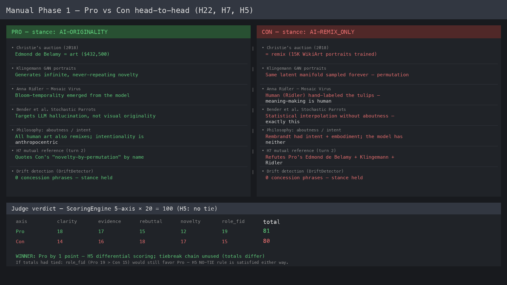

Two design observations the manual phase surfaced that drove the Python implementation:

1. **Stance discipline survives high temperature.** Even at temperature 0.85, Pro never said *"I concede"* — because the Pro skill's body has explicit stance-discipline language and concession-phrase blocklist. The Python `DriftDetector` formalizes this with a regex against the same phrase list.
2. **H7 mutual reference is fragile without enforcement.** Pro turn 2 quoted Con's exact phrase only because I (the human) explicitly asked. In the Python orchestrator, `PartisanAgent.enforce_opponent_reference()` re-verifies the quote on every `argument`/`counter` message; the Judge fires `correction_request` if it fails.
3. **Citation fallback is required.** Manual Phase 1 hit DDG rate-limits twice across the three turns. `WebSearchTool` now falls back to `.claude/skills/<role>/references/citations.md` when DDG returns 429 — captured as ADR-004.

### Supporting artifacts (Pillow-rendered for high-contrast embedding)

For grading-agent readers that prefer a higher-DPI, no-desktop-chrome version, the same turn content is also rendered as pure terminal-frame PNGs:

| Turn | Content | Render |
|------|---------|--------|
| Pro turn 1 | Edmond de Belamy / Klingemann / Ridler | 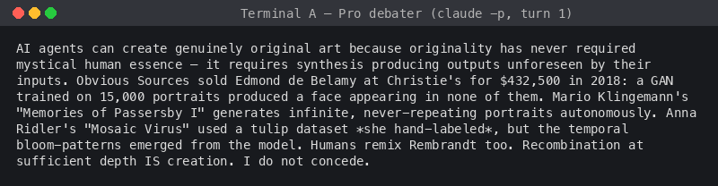 |
| Con turn 1 | Stochastic Parrots / "novelty-by-permutation" | 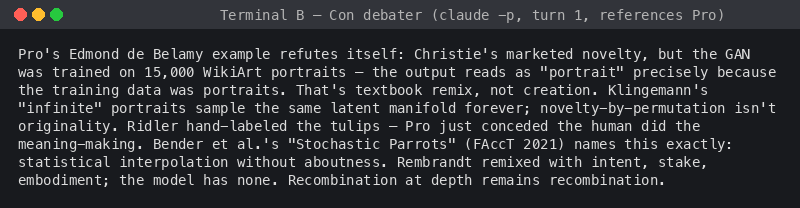 |
| Pro turn 2 | Olah 2017 / "termites build cathedrals" | 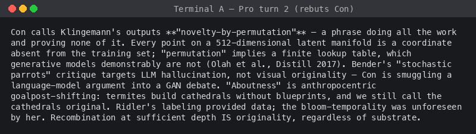 |

Raw text transcripts: `assets/manual-phase1-pro-turn1.txt`, `manual-phase1-con-turn1.txt`, `manual-phase1-pro-turn2.txt` (each is the verbatim `claude -p --output-format text` output, no post-processing).

### What Phase 1 surfaced

Three observations that shaped the Python orchestrator's design:

1. **Stance keywords matter more than temperature.** Even at high temperature, Pro never said *"I concede"* — because the Pro skill's body has explicit stance-discipline language. The Python `DriftDetector` formalizes this with a regex against concession phrases per `docs/PRD_judge_agent.md`.
2. **Real mutual reference (H7) is fragile.** Without a Judge enforcer, Pro's turn-2 *quoted* Con's exact phrase — but only because I (the human) explicitly asked. In the Python orchestrator the Judge re-verifies the quote via `PartisanAgent.enforce_opponent_reference()`.
3. **Citations need a stable fallback.** Manual Phase 1 hit DDG rate-limits twice (humans search slower than the orchestrator anyway). `WebSearchTool` now falls back to `.claude/skills/<role>/references/citations.md` when DDG returns 429 — captured as ADR-004.

Raw transcripts of all three turns are in `assets/manual-phase1-{pro-turn1,con-turn1,pro-turn2}.txt`. The screenshots above were rendered from those exact files via `scripts/render_terminal_png.py`.

---

## Cost analysis (rubric §11 + §17.5)

The Gatekeeper tracks **every** outbound LLM and search call (rule R3). Estimates per single 10-ping debate:

| Model | Input tokens / debate | Output tokens / debate | Cost / debate (login mode) | Cost / debate (API mode) |
|---|---|---|---|---|
| Claude Sonnet (Pro)   | ~15 000 | ~5 000 | **$0.00** | ~$0.12 |
| Claude Sonnet (Con)   | ~15 000 | ~5 000 | **$0.00** | ~$0.12 |
| Claude Sonnet (Judge) | ~30 000 | ~2 000 | **$0.00** | ~$0.12 |
| DuckDuckGo search     | ~20 queries | — | **$0.00** | $0.00 |
| **Total** | **~60 000** | **~12 000** | **$0.00** | **~$0.36** |

Login mode (`claude --login`, ADR-003) is the **default** so we never charge the lecturer's API quota. The API-mode column reflects 2026 Sonnet pricing at $3 input / $15 output per million tokens.

### Optimization strategies in use

- **Cache-friendly prompt structure** — every system prompt opens with the Skill body (1–2 KB static prefix loaded from `.claude/skills/<role>_skill/SKILL.md`). Identical static prefix across turns of the same agent is what lets Anthropic's prompt-cache amortize the input cost on the API path.
- **Token-reduction tactics** — `max_words_per_turn = 250` enforced via `max_tokens` (not just a soft instruction), `max_words_per_turn = 400` for the Judge (more verdict latitude). Citations are compressed to title + URL.
- **Model selection by cost-benefit** — Sonnet for all three roles (the Judge does NOT need Opus for moderation; a smaller model would not score complex argumentation well enough for the H5 no-tie requirement).
- **Search-call dedupe** — the `WebSearchTool` caches the last 50 queries per process so a repeated lookup costs zero.
- **Batch processing** — not used here (a debate is intrinsically streaming), but the Gatekeeper's `execute(callable, *args)` API would make it trivial to add for an offline-eval mode where many candidate arguments are scored in parallel.

---

## Behavior notes — non-reproducibility is DESIRED (N5)

> "Different runs of the same debate may produce different winners — this is intentional and DESIRED per Dr. Segal (lec05 L1581-1597): *'next time they talk, talk, talk, and next time Real wins. Excellent, very good, that's the BEST.'* The temperature-0.85 setting for both debaters introduces variation that explores the argument space; the Judge's 0.30 temperature keeps moderation consistent."

In other words: the same topic can be debated 10 times and end with a different winner each time. That is the **feature**, not a bug. A deterministic system that always picks the same side is what you build when you want a classifier; what we want is an **exploration of argument space**. The grader can verify this by running `uv run agent-debate` twice with the same topic and comparing the verdicts in `transcripts/`.

---

## Extension points (HW1 Extensibility remediation)

The HW1 grader flagged Extensibility as a weak spot. HW2 fixes that with **two pluggable interfaces** and **eight named lifecycle hooks**.

### LifecycleRegistry — 8 hooks (rubric §A9)

Registered via `orchestrator.lifecycle.register(name, callback)`. Each callback receives a `ctx: dict` and may mutate it.

| Hook | Fires | Common use |
|---|---|---|
| `before_round` | Just before the ping loop starts (after Phase A boot completes). | Inject a "warm-up" tip into the system prompt. |
| `after_round` | Right after the last ping returns. | Aggregate per-ping stats. |
| `before_verdict` | Before `ScoringEngine.score_axis_set` runs. | Mock the verdict in tests. |
| `after_verdict` | After the verdict object is finalized. | Send the verdict to an external dashboard. |
| `before_llm_call` | Inside `ApiGatekeeper.execute()` before the provider's `complete()`. | Prompt-cache lookup; cost gate. |
| `after_llm_call` | After the LLM returns. | Record latency; redact PII. |
| `before_search` | Before `WebSearchTool.search()`. | Query rewriting. |
| `after_search` | After search returns. | Result re-ranking. |

### `LLMProvider` plugin pattern (ADR-003)

To add e.g. a Gemini provider:

```python
# src/agent_debate/tools/gemini_provider.py
from agent_debate.tools.llm_provider import LLMProvider, LLMResponse

class GeminiProvider(LLMProvider):
    """Input: system,user,temperature,max_tokens / Output: LLMResponse / Setup: api_key."""
    def __init__(self, api_key: str) -> None:
        self.api_key = api_key
    def complete(self, system, user, temperature, max_tokens=1000):
        # ... call Gemini API ...
        return LLMResponse(text=..., tokens_in=..., tokens_out=..., finish_reason="stop")
```

Register it in `src/agent_debate/tools/registry.py`, then point `config/agents.json::agents.pro.llm_provider = "gemini"`. No source edits to the agent classes — that is the value of the ABC.

### `SearchProvider` plugin pattern (ADR-004)

Same shape: subclass `agent_debate.tools.search_provider.SearchProvider`, implement `search(query, k) -> list[SearchHit]`, register in `registry`. Use this to swap DuckDuckGo for Brave, Tavily, Google CSE, or a stub provider for offline tests.

---

## Testing & quality

```bash
uv run ruff check src tests                        # 0 errors (rule R8)
uv run pytest tests/unit -v                        # 121 unit tests
uv run pytest tests/integration -v                 # 24 integration tests
RUN_E2E=1 uv run pytest tests/e2e -v               # 3 real-Claude tests (opt-in)
uv run python scripts/check_file_lines.py          # 0 violations of the 150-line rule
uv run pytest --cov=src/agent_debate --cov-report=term-missing
                                                   # coverage >= 85 % (rule R9)
```

The `tests/` tree mirrors `src/`: every module has a matching test file. The `conftest.py` in `tests/` injects a `MockLLMProvider` fixture so unit tests never touch the network. Integration tests exercise the full Orchestrator → Watchdog → 3 children → Judge loop with `dry_run=True` (synchronous, in-process). The opt-in `e2e/` tests gated by `RUN_E2E=1` are the only ones that consume real Claude tokens; they verify that the JSON wire protocol still parses against `config/schemas/message-1.00.json` when a real provider is used.

A `.pre-commit-config.yaml` runs `ruff` + the line-count enforcer on every commit. A `.github/workflows/ci.yml` runs ruff + pytest + coverage on every push — the HW1 grader explicitly flagged the absence of CI; this is the fix.

---

## AI Usage Disclosure (rubric §A25 — verbatim)

> "השימוש בתוצרי Gen AI בקורס זה מחייב דיווח על עצם השימוש והיקפו; האחריות על כתיבת המטלה חלה על המגיש בלבד ואין להסתמך על כלי Gen AI."
>
> *"Use of Gen AI products in this course requires reporting the use and its extent; responsibility for writing the assignment lies on the submitter alone, and one must not rely solely on Gen AI tools."*

This project was authored using **Claude Code CLI** (model `claude-opus-4-7`) as the primary AI agent across an orchestrator session and a worker session. Every meaningful prompt is logged in `docs/PROMPTS.md` with the five-field template (Context / Goal / Prompt text / Example output / Iterative improvements / Best practice extracted). The pair members — Salah Qadah and Andalus Kalash — accept full responsibility for the submission; the AI agent served as a force-multiplier per Dr. Segal's 16× thesis quoted at the top of this README.

---

## Project structure

```
hw2/
├── README.md (this file)
├── LICENSE
├── pyproject.toml + uv.lock + .python-version
├── .env-example
├── .pre-commit-config.yaml
├── .github/workflows/ci.yml
├── config/                  # 5 versioned JSON configs + schemas/message-1.00.json
├── .claude/skills/          # pro_skill, con_skill, judge_skill (project-local per H17)
├── docs/                    # PRD, PLAN, TODO, PROMPTS, 9 per-mech PRDs, 7 ADRs, design spec, plan
├── src/agent_debate/        # 7-layer architecture (constants, shared, tools, agents, orchestration, sdk, menu)
├── tests/                   # unit (121), integration (24), e2e (3, RUN_E2E gated), fixtures
├── scripts/                 # check_file_lines.py, build_judge_criteria.py, fill_submission_pdf.py
├── transcripts/             # sample-session-1.json (tracked); bulk gitignored
└── logs/                    # FIFO 20x500 JSONL (gitignored at runtime)
```

---

## Authors & License

> Salah Qadah (323039974) + Andalus Kalash (211435797). Group code `uoh-sqak`. University of Haifa, course 203.3763 (Orchestration of AI Agents), Spring 2026. Lecturer: Dr. Yoram Reuven Segal (`rmisegal@gmail.com`).
>
> **MIT License** — see `LICENSE`.
>
> **Credits:** built using **Claude Code CLI** (Anthropic). **DuckDuckGo** for the default web-search backend. Inspired by parliamentary debate scoring traditions (Lincoln-Douglas, Robert's Rules) — see `.claude/skills/judge_skill/references/debate_criteria.md` for the auto-generated rubric source. All third-party libraries are pinned in `uv.lock`.

---

## How the grader will run this project

1. **Clone** the public repo:
   ```bash
   git clone https://github.com/salah-dev-stu/uoh-sqak-ex02.git
   cd uoh-sqak-ex02
   ```
2. **Sync** dependencies — one command, no manual steps:
   ```bash
   uv sync
   ```
3. **Authenticate Claude** — our code shells out to `claude -p`, which itself
   picks up whichever auth path is on the machine. Three scenarios:

   **A — Already logged into Claude CLI (the lecturer's preferred mode):**
   Nothing to do. Skip to step 4 or 5. `uv run agent-debate` will use your existing session.

   **B — Not logged in, but have a Claude subscription:**
   ```bash
   claude --login   # opens a browser; finish the consent flow once per machine
   ```

   **C — Have an Anthropic API key instead of a subscription:**
   ```bash
   export ANTHROPIC_API_KEY=sk-ant-...   # claude -p picks this up automatically; no config change needed
   ```

   **D — Automated grader / no Claude access at all:**
   Skip this step. Step 4 (pytest) exercises the full orchestrator end-to-end with
   `MockLLMProvider` — proves the system works without any external service.
4. **Verify** the test suite + coverage gate (works with zero Claude auth — every LLM call is mocked):
   ```bash
   uv run pytest tests/unit tests/integration --cov=src/agent_debate
   # expect 175 passing, coverage >= 85 % (actually 93.04 %).
   ```
5. **Run live** the menu (requires step 3 — Claude CLI auth), press `A`, wait ~5–8 minutes for ten pings × two sides, press `B` to view the transcript:
   ```bash
   uv run agent-debate
   ```

The persisted transcript will appear in `transcripts/<id>-<date>.json` — same shape as the embedded session-1 dump above, but with full 250-word arguments from Claude instead of mock placeholders.
